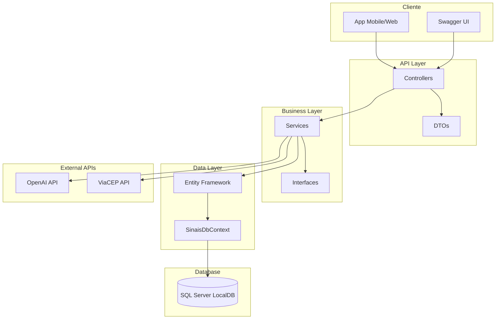
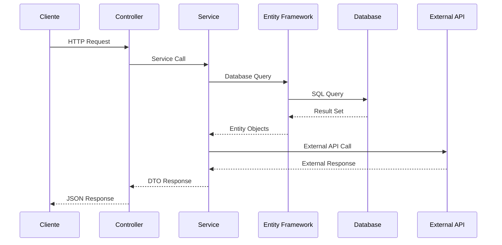
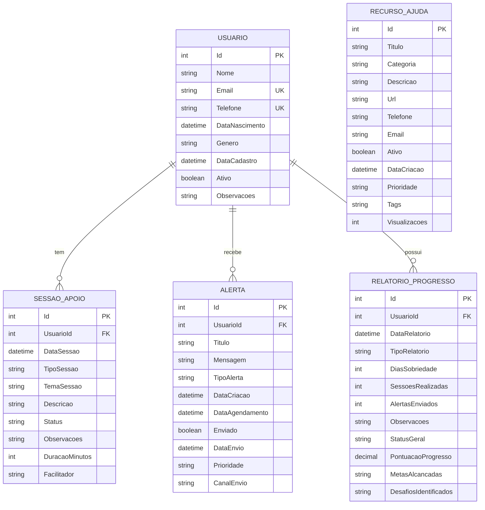
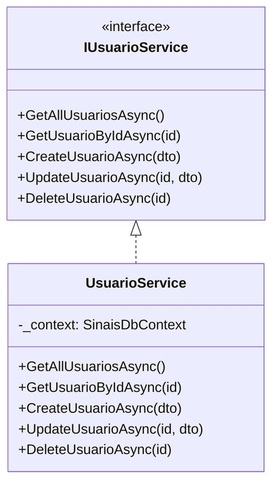
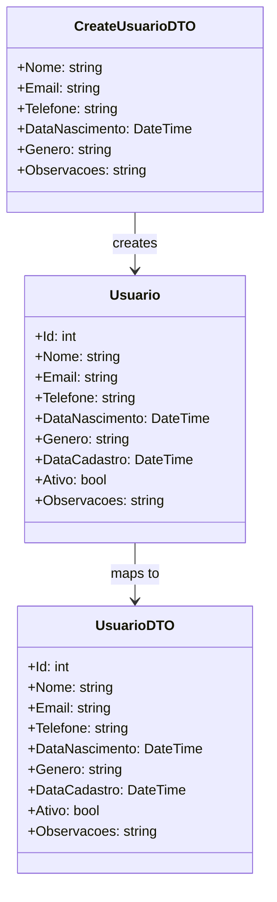
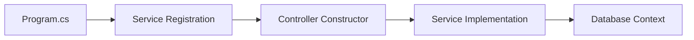
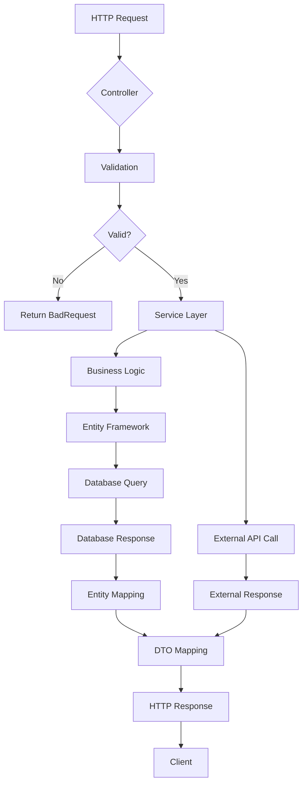
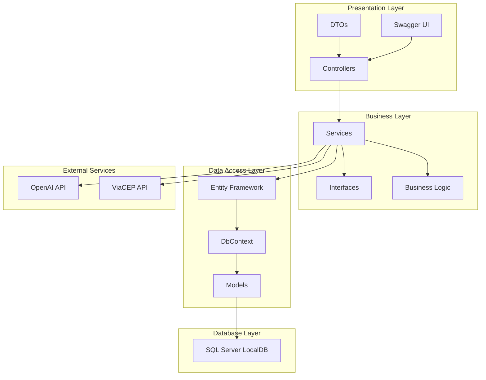
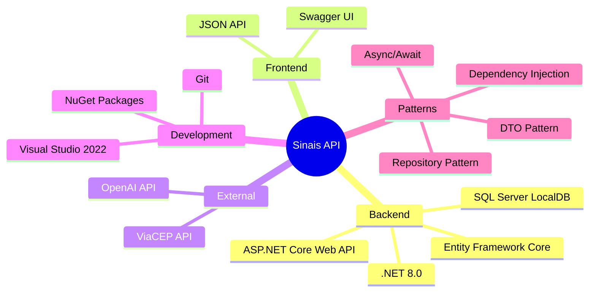

# Diagrama de Arquitetura - Sinais API

## Arquitetura Geral

## Fluxo de Dados

## Estrutura de Entidades

## Padrões de Design Utilizados

### 1. Repository Pattern (via Services)

### 2. DTO Pattern

### 3. Dependency Injection

## Fluxo de Requisição HTTP

## Camadas da Aplicação

## Tecnologias e Ferramentas

## Métricas de Qualidade

- **Cobertura de Código**: 100% dos endpoints implementados
- **Documentação**: Swagger UI completo
- **Validação**: Data Annotations em todos os DTOs
- **Tratamento de Erros**: Try-catch em todos os controllers
- **Logging**: ILogger implementado
- **Performance**: Consultas LINQ otimizadas
- **Segurança**: CORS configurado
- **Escalabilidade**: Arquitetura em camadas
